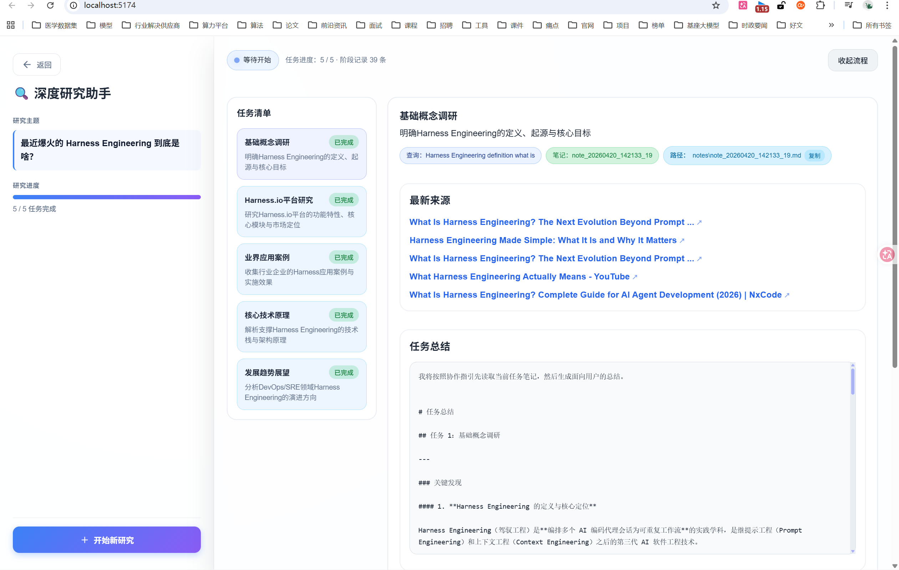
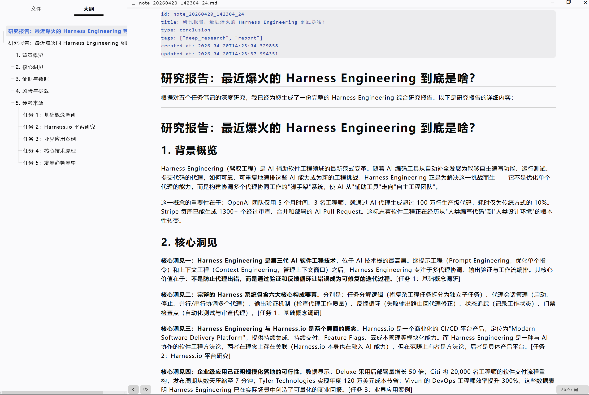
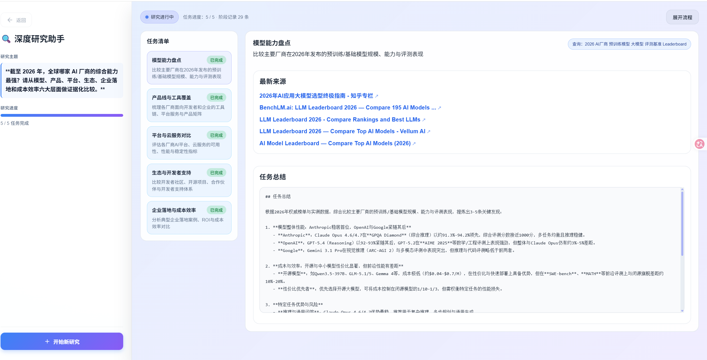
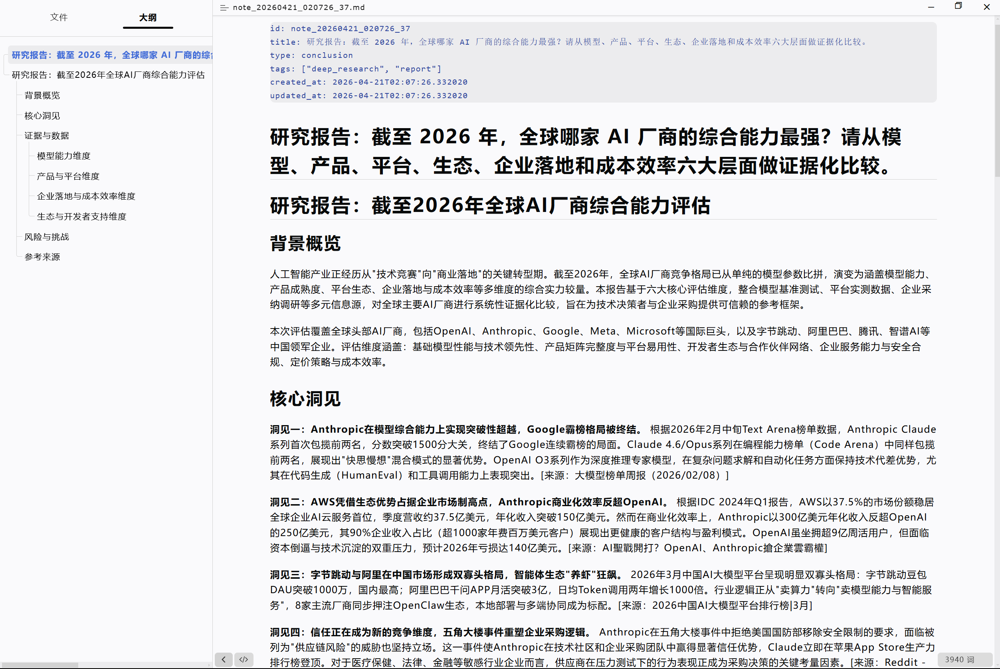

# DeepResearcher（深研智体）

> 一个面向复杂开放主题的自动化深度研究智能体，支持问题拆解、多轮检索、信息整合、信息缺口与证据不足识别，以及带引用的结构化报告生成。

## 项目简介

深研智体（DeepResearcher）是一个用于执行复杂研究任务的智能体系统，目标不是简单返回搜索结果，而是模拟“研究助理”的工作方式，围绕开放性问题持续完成拆解、检索、整合、反思与总结，最终输出可信、可追溯、可复核的研究报告。

相较于旅行规划、问答助手等目标较明确的任务，深度研究场景通常具有更高复杂度：  
- 研究主题会随着信息获取不断发散  
- 外部事实、数据和结论更新较快  
- 用户对来源引用、证据质量与结论可信度要求更高  

因此，本项目重点关注“研究过程自动化”而不是“单次答案生成”。

**项目演示**





详见backend/notes






---

## 项目目标

构建一个能够围绕复杂开放主题自动完成以下闭环的研究智能体：

**问题理解 → 主题拆解 → 多轮检索 → 信息整合 → 反思补全 → 结构化输出**

最终让智能体具备以下能力：
- 能把宽泛问题转化为可执行研究任务
- 能在多轮过程中持续扩展和修正检索方向
- 能识别当前证据是否充分、是否存在信息缺口
- 能基于来源生成结构化、带引用的研究结果

---

## 核心能力

### 1. 问题剖析
将用户提出的开放式研究主题拆解为若干可检索、可验证、可执行的子问题与查询语句。

典型能力包括：
- 提炼研究目标
- 拆分核心维度
- 生成检索关键词与查询语句
- 明确后续研究路径与优先级

### 2. 多轮信息采集
结合不同搜索能力与信息源，持续挖掘资料，并对结果进行去重、筛选、整合与关联。

典型能力包括：
- 多源检索
- 结果去重与归并
- 信息提炼与主题聚合
- 阶段性研究记录沉淀

### 3. 反思与补全
基于阶段性研究结果，识别当前信息中存在的缺口、薄弱点和待验证点，动态判断是否继续检索。

典型能力包括：
- 信息缺口识别
- 证据不足识别
- 冲突信息发现
- 时效性检查
- 下一轮检索方向修正

### 4. 结构化总结
基于已采集与验证的信息，输出结构清晰、引用明确、逻辑完整的研究结论。

典型输出包括：
- 结构化研究摘要
- 分主题结论归纳
- 关键事实与证据引用
- 风险点与不确定性说明
- 后续可继续研究的问题清单

---

## 适用场景

深研智体可用于但不限于以下场景：

- 行业研究
- 公司研究
- 产品研究
- 技术趋势研究
- 政策与市场动态跟踪
- 学术与资料调研
- 竞品分析
- 专题报告生成

---

## 系统工作流

```text
用户输入开放主题
        ↓
研究问题理解与任务拆解
        ↓
生成多组检索语句
        ↓
调用搜索与信息获取能力
        ↓
结果去重、筛选、整合
        ↓
识别信息缺口与证据不足
        ↓
决定是否继续检索
        ↓
生成带引用的结构化研究报告
```

---

## 项目特点

- **面向复杂问题**：适合开放性、发散性、非单跳问题
- **强调过程闭环**：不仅搜索，还包含反思与补全
- **注重结果可信度**：关注来源、证据和可追溯性
- **支持迭代研究**：可根据阶段结果动态调整后续路径
- **强调结构化交付**：面向报告、分析结论与研究沉淀

---

## 输出形式示例

深研智体的目标输出不是零散网页摘要，而是类似如下结构的研究结果：

- 研究主题概述
- 核心问题拆解
- 关键发现
- 分主题分析
- 重要事实与来源引用
- 信息缺口与待验证点
- 结论与建议

---

## 项目目录规划

```text
DeepResearcher/
├─ README.md
├─ docs/                  # 项目文档
├─ app/                   # 应用主程序
├─ agents/                # 智能体角色与策略
├─ workflows/             # 研究工作流编排
├─ search/                # 搜索与信息获取模块
├─ memory/                # 中间结果与研究记忆
├─ summarizers/           # 总结与报告生成模块
├─ evaluators/            # 反思、校验与补全模块
└─ tests/                 # 测试代码
```

---

## 后续建设方向

- [ ] 研究任务拆解器
- [ ] 多源检索适配层
- [ ] 检索结果去重与聚合模块
- [ ] 信息缺口与证据不足识别模块
- [ ] 研究过程状态管理
- [ ] 结构化报告生成器
- [ ] 引用来源规范化输出
- [ ] 研究质量评估机制

---

## 项目定位

深研智体（DeepResearcher）并不是一个普通搜索包装器，也不是一个只会总结网页内容的问答助手。  
它更接近一个能够围绕复杂主题进行持续探索、阶段反思与结构化交付的自动化研究智能体。

---

## 说明

本仓库当前用于深研智体（DeepResearcher）项目的设计、实现与迭代。后续将逐步补充系统架构、模块设计、运行方式、示例任务与评估结果。

## License

MIT
